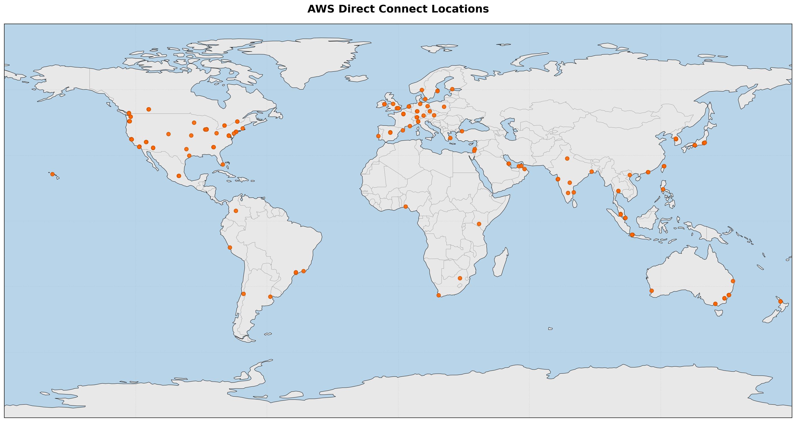

# DX Location Details Table Generator

## Overview
Automatically generates a sortable wiki table and KML file of AWS Direct Connect locations.

**Live View**: [Interactive Table with Map](https://chriselsen.github.io/dx-location-details/)



> [!NOTE]
> Although I do work for AWS, no internal data is being used in this repo. Mapping of DX locations to PeeringDB locations is solely performed manually through public information.

## Files
- `scripts/collect_data.py` - Fetches DX locations from AWS CLI and merges with mapping data
- `scripts/generate_csv.py` - Generates CSV file from collected data
- `scripts/generate_github_pages.py` - Generates HTML files for GitHub Pages
- `scripts/add_location.py` - Interactive tool to add new locations to the mapping
- `data-structures/location-mapping.json` - Mapping of location codes to PeeringDB IDs and coordinates

## Workflow

### Quick Start - Generate All Outputs
To run all generation steps at once (recommended for weekly updates):
```bash
bash scripts/generate_all.sh
```

This runs steps 1-5 in sequence:
1. Collect data from AWS
2. Generate CSV file
3. Generate KML files
4. Generate world map PNG
5. Generate GitHub Pages HTML

### Individual Steps

### 0. Install Dependencies (First Time Only)
Before generating the world map PNG, install required dependencies:
```bash
bash scripts/install_map_deps.sh
```

This installs:
- `matplotlib` - For plotting and image generation
- `cartopy` - For geographic map projections

### 1. Collect Data
Fetches all DX locations from AWS and merges with the mapping file:
```bash
python3 scripts/collect_data.py
```

**Prerequisites:** AWS CLI must be installed and configured with credentials. All AWS regions must be enabled for the account.

This creates `data-structures/dx-locations-data.json` with complete location information.

### 2. Generate CSV File
Creates a CSV file with all location data:
```bash
python3 scripts/generate_csv.py
```

Output: `output/DX_LOCATIONS.csv`

### 3. Generate KML Files
Creates KML files for Google Maps/Earth with custom icon:
```bash
python3 scripts/generate_kml.py
```

Outputs:
- `output/DirectConnectLocations.kml` - All locations
- `output/DirectConnectLocations_APAC.kml` - Asia Pacific locations
- `output/DirectConnectLocations_EMEA.kml` - Europe, Middle East, Africa locations
- `output/DirectConnectLocations_NA.kml` - North America locations
- `output/DirectConnectLocations_SA.kml` - South America locations

The icon used in KML files is defined in `icons/icon.txt` (base64-encoded image).

### 4. Generate World Map PNG
Creates a world map visualization with all DX locations:
```bash
python3 scripts/generate_map_png.py
```

Output: `output/DX_Locations.png`

### 5. Generate GitHub Pages
Creates HTML files for GitHub Pages with interactive table and map:
```bash
python3 scripts/generate_github_pages.py
```

Outputs:
- `docs/index.html` - Interactive page with integrated map and sortable/filterable table

### 6. Sync with PeeringDB
Updates country codes and coordinates from PeeringDB for all locations:
```bash
python3 scripts/sync_peeringdb.py
```

This script:
- Fetches country codes, coordinates, and state (for US) from PeeringDB API
- Updates entries if data has changed in PeeringDB
- Respects rate limiting (1 request/second with exponential backoff)
- Takes ~2-3 minutes for all locations

Run this periodically to keep location data synchronized with PeeringDB.

### 7. Add New Locations
When new DX locations appear in AWS, use the interactive tool:

```bash
python3 scripts/add_location.py
```

The tool will prompt you for:
- **Location code**: AWS location code (e.g., TCCBK)
- **PeeringDB ID**: PeeringDB facility ID (optional - press Enter to skip)

If you provide a PeeringDB ID, the tool will automatically fetch the facility name and coordinates from PeeringDB.

After adding a location, regenerate the data:
```bash
python3 scripts/collect_data.py
python3 scripts/generate_csv.py
```

## Location Code Normalization
The system automatically normalizes location codes:
- Floor suffixes: `IAMGI-32FL` → `IAMGI`
- MMR suffixes: `NMBL2-MMR-1A` → `NMBL2`
- POP suffixes: `EQRJ2-21001` → `EQRJ2`
- Case: `EqOS1` → `EQOS1`

## Data Structure
`data-structures/dx-locations-data.json` contains:
- `code`: AWS location code (normalized)
- `region`: AWS region code
- `name`: Location name from AWS
- `peeringdb_id`: PeeringDB facility ID
- `latitude`: Facility latitude
- `longitude`: Facility longitude

## GitHub Pages
The repository publishes an interactive HTML page via GitHub Pages:
- **Interactive Table with Map**: https://chriselsen.github.io/dx-location-details/

This page is automatically updated daily via GitHub Actions.
