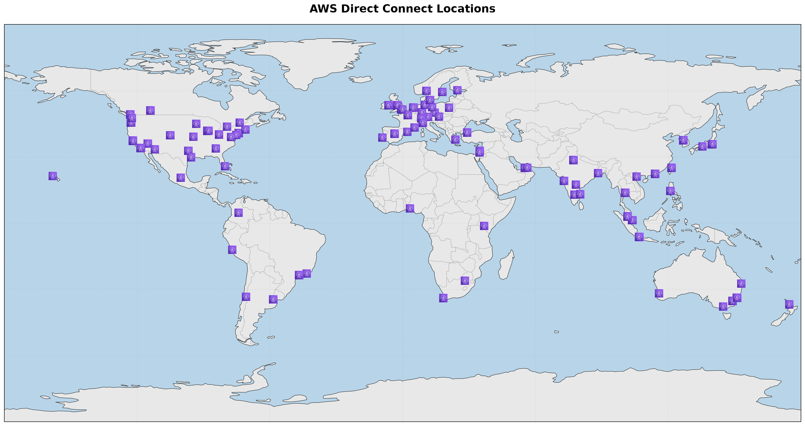

# DX Location Details Table Generator

[](https://github.com/chriselsen/dx-location-details/actions/workflows/daily-update.yml)

## Overview
Automatically generates a sortable wiki table and KML file of AWS Direct Connect locations across AWS Commercial, EU Sovereign Cloud, and China partitions.

**Live View**: [Interactive Table with Map](https://chriselsen.github.io/dx-location-details/)

**Downloads**: 
- **AWS Commercial Partition**: [KML File](output/DirectConnectLocations.kml) | [CSV File](output/DX_LOCATIONS.csv)
- **EU Sovereign Cloud**: [KML File](output/DirectConnectLocations_EUSC.kml) | [CSV File](output/DX_LOCATIONS_EUSC.csv)
- **AWS China**: [KML File](output/DirectConnectLocations_CHINA.kml) | [CSV File](output/DX_LOCATIONS_CHINA.csv)



> [!NOTE]
> Although I do work for AWS, no internal data is being used in this repo. Mapping of DX locations to PeeringDB locations is solely performed manually through public information.

## Files
- `scripts/collect_data.py` - Fetches DX locations from AWS Commercial partition
- `scripts/collect_data_eusc.py` - Fetches DX locations from EU Sovereign Cloud
- `scripts/collect_data_china.py` - Fetches DX locations from AWS China partition
- `scripts/merge_partitions.py` - Merges data from all three partitions
- `scripts/generate_csv.py` - Generates CSV file for Commercial partition
- `scripts/generate_csv_eusc.py` - Generates CSV file for EU Sovereign Cloud
- `scripts/generate_csv_china.py` - Generates CSV file for AWS China
- `scripts/generate_kml.py` - Generates KML files for Commercial partition
- `scripts/generate_kml_eusc.py` - Generates KML file for EU Sovereign Cloud
- `scripts/generate_kml_china.py` - Generates KML file for AWS China
- `scripts/generate_map_png.py` - Generates world map PNG
- `scripts/generate_github_pages.py` - Generates HTML page for GitHub Pages (`output/web/`)
- `scripts/generate_all.sh` - Runs all generation steps for Commercial partition
- `scripts/sync_peeringdb.py` - Syncs location data from PeeringDB
- `scripts/add_location.py` - Adds new locations to the mapping
- `scripts/install_map_deps.sh` - Installs dependencies for map PNG generation
- `data-structures/location-mapping.json` - Mapping of location codes to PeeringDB IDs and coordinates

## Automation
The repository automatically updates daily via GitHub Actions (`.github/workflows/daily-update.yml`):
- Collects data from all three partitions (Commercial, EU Sovereign Cloud, China)
- Regenerates all outputs (CSV, KML, PNG, GitHub Pages)
- Only commits if data has actually changed

For setup instructions, see [AWS GitHub OIDC Setup](docs/AWS_GITHUB_SETUP.md).

## Manual Workflow

### 0. Install Dependencies (First Time Only)
```bash
bash scripts/install_map_deps.sh
```
Installs `matplotlib` and `cartopy` for world map PNG generation.

### 1. Collect Data
Fetch DX locations from AWS for all partitions and merge:
```bash
python3 scripts/collect_data.py
python3 scripts/collect_data_eusc.py
python3 scripts/collect_data_china.py
python3 scripts/merge_partitions.py
```

**Prerequisites:** AWS CLI must be installed and configured with credentials for each partition.

### 2. Generate All Outputs
Run all generation steps at once:
```bash
bash scripts/generate_all.sh
```

This generates:
- CSV files for all partitions → `output/DX_LOCATIONS*.csv`
- KML files for all partitions → `output/DirectConnectLocations*.kml`
- World map PNG → `output/DX_Locations.png`
- GitHub Pages HTML → `output/web/index.html`

### 3. Sync with PeeringDB (Periodic)
Updates country codes, coordinates, and organization data from PeeringDB:
```bash
python3 scripts/sync_peeringdb.py
```
- Fetches country, coordinates, state (US only), and organization info from PeeringDB API
- Only updates entries where data has changed
- Respects rate limiting (1 request/second with exponential backoff)
- Takes ~2-3 minutes for all locations

### 4. Add New Locations

#### Option A: Via GitHub Actions (no local setup required)
Trigger the **Add New DX Location** workflow from the GitHub Actions tab:
- Go to **Actions** → **Add New DX Location** → **Run workflow**
- Enter the AWS location code and optionally a PeeringDB facility ID
- The workflow adds the location, regenerates all outputs, and commits automatically

#### Option B: Locally
```bash
python3 scripts/add_location.py
```
The tool prompts for:
- **Location code**: AWS location code (e.g., TCCBK)
- **PeeringDB ID**: PeeringDB facility ID (optional)

If a PeeringDB ID is provided, facility name, coordinates, and organization are fetched automatically.

After adding a location, regenerate the data:
```bash
bash scripts/generate_all.sh
```

## Location Code Normalization
The system automatically normalizes location codes:
- Floor suffixes: `IAMGI-32FL` → `IAMGI`
- MMR suffixes: `NMBL2-MMR-1A` → `NMBL2`
- POP suffixes: `EQRJ2-21001` → `EQRJ2`
- Case: `EqOS1` → `EQOS1`

## Data Structure
`data-structures/dx-locations-data.json` contains:
- `code`: AWS location code (normalized)
- `region`: AWS region code
- `name`: Location name from AWS
- `peeringdb_id`: PeeringDB facility ID
- `org_id`: PeeringDB organization ID
- `org_name`: Organization name
- `latitude`: Facility latitude
- `longitude`: Facility longitude
- `providers`: List of DX Partners (normalized names)

## GitHub Pages
The repository publishes an interactive HTML page via GitHub Pages:
- **Interactive Table with Map**: https://chriselsen.github.io/dx-location-details/

The page features a tabbed interface with:
- **AWS Commercial Partition**: Global Direct Connect locations
- **AWS GovCloud (US)**: Uses the same locations as Commercial (connected via Direct Connect Gateway)
- **EU Sovereign Cloud**: European locations in the isolated EU partition
- **AWS China**: China locations in the isolated China partition operated by local partners

Features:
- Click anywhere on the map to find the two nearest DX locations, with distance and minimum RTT latency displayed
- Filter by country, organization, DX partners, port speeds, MACsec support, and associated region
- DX Partners column shows the number of partners at each location with a tooltip listing all of them
- Help panel (?) with documentation about page features and icons
- Machine-readable JSON available at `locations.json`

## Provider Name Normalization
The `collect_data.py` script normalizes DX Partner names from the AWS API:
- Strips corporate suffixes: Ltd, Inc, AG, GmbH, Sdn Bhd, Berhad, SA de CV, SPA, Pty, Corp
- Consolidates aliases (e.g., "CenturyLink" → "Lumen", "Equinix, Inc." → "Equinix")
- Merges regional variants (e.g., all "China Telecom ..." → "China Telecom")
